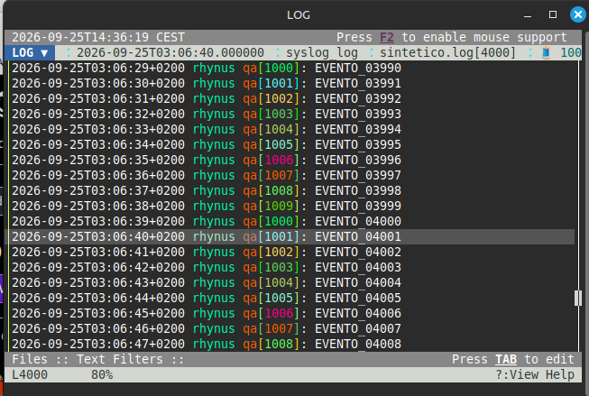
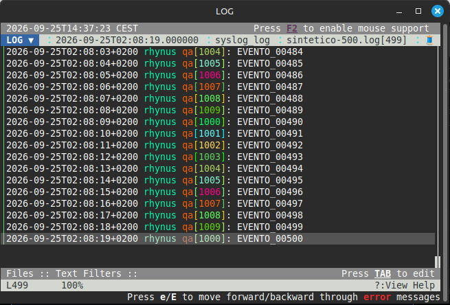
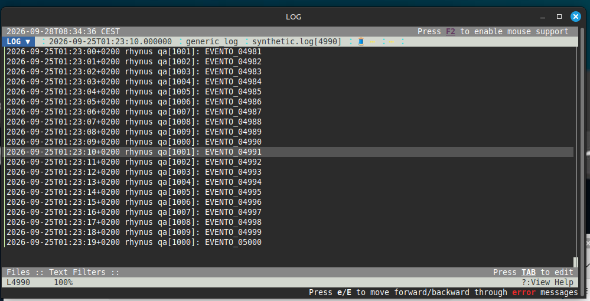

# OSS QA Case Study: lnav #1741

Independent reproduction and comparison for:

- Project: `tstack/lnav`
- Issue: `#1741 - Unable to open a file at a specific line number`

## Environment

- Linux Mint / Ubuntu 24.04 base
- lnav 0.14.1
- Synthetic syslog-style input
- 500 and 5000 line test files

## Objective

Compare three navigation methods:

1. interactive `:goto NNN`
2. `file:line`
3. command-line `-c ':goto NNN'`

## Generate test data

```bash
./generate-log.sh synthetic.log 5000
./generate-log.sh synthetic-500.log 500
```

## Result matrix

| Method | Expected | Observed |
|---|---|---|
| Interactive `:goto 4000` | Navigate to line 4000 | Works |
| `synthetic-500.log:400` | Open around line 400 | Opens near end |
| `-c ':goto 4000' synthetic.log` | Navigate to line 4000 | Opens near end |

## Interactive navigation

```bash
lnav synthetic.log
```

Then inside lnav:

```text
:goto 4000
```

Observed:

- navigation succeeds
- lnav lands around `L4000`
- `EVENTO_04000` is visible

Evidence:



## file:line navigation

```bash
lnav synthetic-500.log:400
```

Observed:

- requested line is not selected
- lnav opens near the end of the file

Evidence:



## Command-line goto

```bash
lnav -c ':goto 4000' synthetic.log
```

Observed on lnav 0.14.1:

- command does not land at line 4000
- displayed position is approximately `L4990 / 100%`

Evidence:



## Observation

Interactive `:goto` behaves differently from both command-line navigation methods in this synthetic syslog test.

The result reproduces the command-line `-c ':goto NNN'` behavior described in the upstream issue.

## Scope

This repository documents an independent reproduction.

It does not claim to identify the root cause or provide a source-code fix.

## Upstream issue

https://github.com/tstack/lnav/issues/1741
